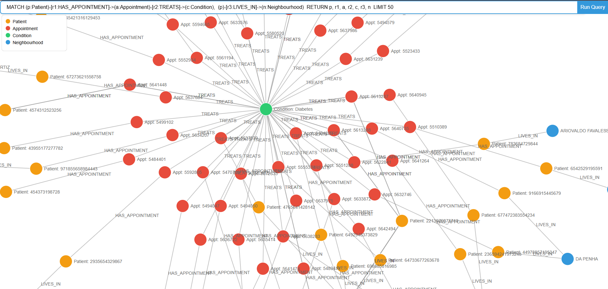

# Healthcare No-Show Graph Explorer

An interactive graph visualization of 100,000+ patient appointment records, built on Neo4j and rendered with D3.js. Graph databases make this dataset shine — relationships between patients, conditions, appointments, and neighborhoods are first-class citizens, enabling traversal queries that would require complex JOINs in SQL.

**[Live Demo](https://neo4j-project-as8675.onrender.com)** · Note: hosted on Render free tier, may take ~30s to wake from idle.



## Tech Stack

- **Neo4j AuraDB** — cloud-hosted graph database
- **D3.js** — force-directed graph rendering
- **Express.js** — REST API serving Cypher query results
- **Vanilla JS** — no frontend framework

## How It Works

Type any Cypher query into the input box and hit **Run Query**. The Express server forwards it to Neo4j and returns nodes and relationships as JSON. D3.js renders a live, draggable, zoomable force graph.

## Sample Queries

**Patients with conditions in a specific neighborhood:**
```cypher
MATCH (p:Patient)-[r1:DIAGNOSED_WITH]->(c:Condition),
      (p)-[r2:LIVES_IN]->(n:Neighbourhood)
WHERE n.name = 'JARDIM DA PENHA'
RETURN p, c, n, r1, r2
LIMIT 300
```

**No-show appointments by condition:**
```cypher
MATCH (p:Patient)-[r1:HAS_APPOINTMENT]->(a:Appointment)-[r2:TREATS]->(c:Condition)
WHERE a.showed_up = false
RETURN p, a, c, r1, r2
LIMIT 300
```

**Patients with multiple conditions who missed appointments:**
```cypher
MATCH (p:Patient)-[:DIAGNOSED_WITH]->(c:Condition)
WITH p, count(c) AS condition_count
WHERE condition_count > 1
MATCH (p)-[r1:HAS_APPOINTMENT]->(a:Appointment)
WHERE a.showed_up = false
MATCH (p)-[r2:DIAGNOSED_WITH]->(c)
MATCH (p)-[r3:LIVES_IN]->(n:Neighbourhood)
RETURN p, r1, a, r2, c, r3, n
LIMIT 1000
```

## Graph Schema

```
(Patient)-[:HAS_APPOINTMENT]->(Appointment)
(Patient)-[:LIVES_IN]->(Neighbourhood)
(Patient)-[:DIAGNOSED_WITH]->(Condition)
(Appointment)-[:TREATS]->(Condition)
(Appointment)-[:LOCATED_IN]->(Neighbourhood)
```

## Running Locally

```bash
npm install
```

Create a `.env` file:
```
NEO4J_URI=bolt://localhost:7687
NEO4J_USER=neo4j
NEO4J_PASSWORD=your_password
NEO4J_DATABASE=healthcare
```

Load the data into Neo4j using `data/load_script.cypher` (full dataset) or `data/load_script_limited.cypher` (20K rows, fits AuraDB free tier), then:

```bash
node index.js
```
